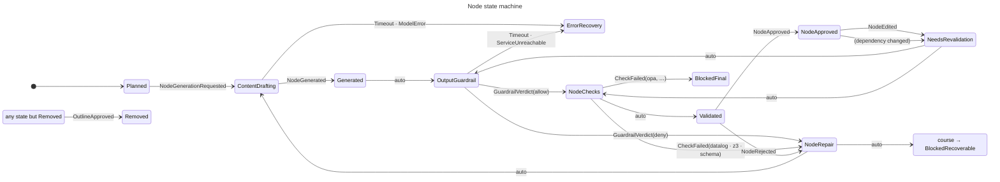

# State machines

Generated from `transitions.yaml` by `export-model.py` on 2026-08-24.
Do not edit: change `../transitions.html` and re-run the exporter.

## Revision machine

```mermaid
---
title: Revision state machine
---
stateDiagram-v2
    direction LR
    state "any non-terminal draft state" as Xanynonterminaldraftstate
    state "any state in the live lineage" as Xanystateinthelivelineage
    state "rev n+1 · ContentInProgress (spawn)" as Xrevn1ContentInProgressspawn
    state "rev n+1 · ContentInProgress (spawn; this revision does not move)" as Xrevn1ContentInProgressspawnt
    state "the state after the operation" as Xthestateaftertheoperation
    state "the state that blocked" as Xthestatethatblocked
    state "the state that issued the operation" as Xthestatethatissuedtheoperati

    [*] --> AwaitingBrief

    AwaitingBrief --> BriefValidation : BriefSubmitted
    BriefValidation --> BlockedRecoverable : auto
    BriefValidation --> BlockedFinal : auto
    BriefValidation --> BlockedFinal : GuardrailVerdict(deny)
    BriefValidation --> BriefFeasibility : GuardrailVerdict(allow)
    BriefValidation --> ErrorRecovery : Timeout · ServiceUnreachable
    BriefFeasibility --> OutlineDrafting : auto
    BriefFeasibility --> BlockedRecoverable : auto
    ContentInProgress --> OutlineChecks : OutlineRevised
    BlockedRecoverable --> OutlineChecks : OutlineRevised
    BlockedRecoverable --> BriefValidation : BriefSubmitted
    BlockedRecoverable --> OutlineDrafting : BlockedInputFixed
    BlockedRecoverable --> Xthestatethatblocked : BlockedInputFixed
    OutlineDrafting --> OutlineGuardrail : OutlineGenerated
    OutlineDrafting --> ErrorRecovery : Timeout · ModelError
    OutlineGuardrail --> ErrorRecovery : Timeout · ServiceUnreachable
    OutlineGuardrail --> OutlineChecks : GuardrailVerdict(allow)
    OutlineGuardrail --> OutlineRepair : GuardrailVerdict(deny)
    OutlineChecks --> OutlineReview : auto
    OutlineChecks --> BlockedFinal : CheckFailed(opa, …)
    OutlineChecks --> OutlineRepair : CheckFailed(datalog · z3 · schema)
    OutlineRepair --> OutlineDrafting : auto
    OutlineRepair --> BlockedRecoverable : auto
    OutlineRepair --> BlockedRecoverable : auto
    OutlineReview --> OutlineDrafting : OutlineRejected
    OutlineReview --> ContentInProgress : OutlineRejected
    OutlineReview --> ContentInProgress : OutlineApproved
    ContentInProgress --> BlockedRecoverable : (node → BlockedFinal)
    ContentInProgress --> ReadyForReview : (node state changed)
    ReadyForReview --> ContentInProgress : NodeEdited(any)
    WholeCourseChecks --> ContentInProgress : NodeEdited(any)
    PendingApproval --> ContentInProgress : NodeEdited(any)
    Approved --> ContentInProgress : NodeEdited(any)
    ReadyForReview --> WholeCourseChecks : CourseChecksRequested
    WholeCourseChecks --> PendingApproval : auto
    WholeCourseChecks --> ContentInProgress : CheckFailed(layer, nodes)
    PendingApproval --> ContentInProgress : ApprovalRejected
    PendingApproval --> Approved : ApprovalGranted
    Approved --> ContentInProgress : ReturnedToWork
    Approved --> Published : PublishRequested
    Published --> Xrevn1ContentInProgressspawnt : ReviseRequested
    Published --> StaleReview : PolicyChanged · CatalogChanged · KBUpdated
    Xanystateinthelivelineage --> Withdrawn : WithdrawRequested
    Published --> Superseded : LivePointerMoved
    Published --> Published : LearnersNotified
    StaleReview --> Published : auto
    StaleReview --> Withdrawn : auto
    StaleReview --> ErrorRecovery : Timeout · ServiceUnreachable
    StaleReview --> Withdrawn : WithdrawRequested
    Superseded --> StaleReview : RollbackRequested
    Superseded --> StaleReview : PolicyChanged · CatalogChanged · KBUpdated
    Superseded --> Archived : ArchiveRequested
    Withdrawn --> Archived : ArchiveRequested
    Withdrawn --> Xrevn1ContentInProgressspawn : ReviseRequested
    Xanynonterminaldraftstate --> Archived : DraftDiscarded
    ErrorRecovery --> Xthestateaftertheoperation : auto
    ErrorRecovery --> Xthestatethatissuedtheoperati : auto
    ErrorRecovery --> BlockedRecoverable : auto
```

## Node machine

```mermaid
---
title: Node state machine
---
stateDiagram-v2
    direction LR
    state "any state but Removed" as XanystatebutRemoved
    state "course → BlockedRecoverable" as XcourseBlockedRecoverable

    [*] --> Planned

    Planned --> ContentDrafting : NodeGenerationRequested
    ContentDrafting --> Generated : NodeGenerated
    ContentDrafting --> ErrorRecovery : Timeout · ModelError
    Generated --> OutputGuardrail : auto
    OutputGuardrail --> ErrorRecovery : Timeout · ServiceUnreachable
    OutputGuardrail --> NodeChecks : GuardrailVerdict(allow)
    OutputGuardrail --> NodeRepair : GuardrailVerdict(deny)
    NodeChecks --> Validated : auto
    NodeChecks --> BlockedFinal : CheckFailed(opa, …)
    NodeChecks --> NodeRepair : CheckFailed(datalog · z3 · schema)
    NodeRepair --> ContentDrafting : auto
    NodeRepair --> XcourseBlockedRecoverable : auto
    Validated --> NodeApproved : NodeApproved
    Validated --> NodeRepair : NodeRejected
    NodeApproved --> NeedsRevalidation : NodeEdited
    NodeApproved --> NeedsRevalidation : (dependency changed)
    NeedsRevalidation --> OutputGuardrail : auto
    NeedsRevalidation --> NodeChecks : auto
    XanystatebutRemoved --> Removed : OutlineApproved
```
